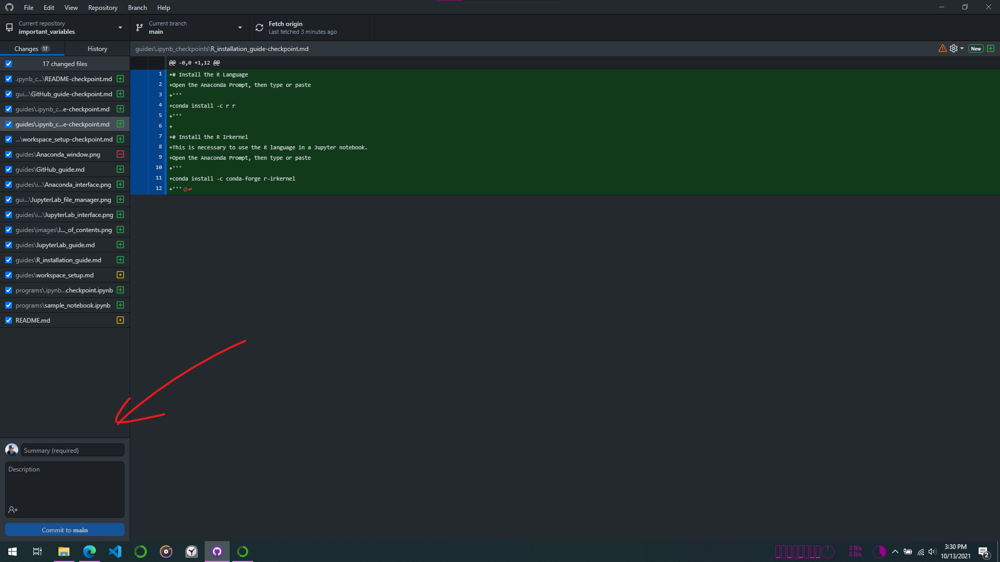

# Intention

# What is GitHub
GitHub has 3 main uses:
1. Code/File backup
Store a copy of your files on GitHub's servers
1. Version Control
If multiple people are working on a project, GitHub offers some nice features to track who is doing what.
1. File Rendering
GitHub knows how to nicely display certain filetypes that make simply viewing certain files much easier (this very Markdown document for example)

# How to use GitHub
1. Make an account on [GitHub](https://github.com/)
1. Create a Repository on GitHub
This is essentially a folder where you can store files.
1. Install GitHub Desktop (see [Installing GitHub Desktop](#installing-github-desktop))
1. Clone your Repository with GitHub Desktop
This creates a local (on your hard drive) copy of your Repository
1. Edit and run your code locally as normal
1. When you want to upload your code
* Save your work locally  
* Open GitHub Desktop  
* Navigate to your Repository  
Your changes should be displayed here. Green shows additions, red shows deletions. Should look something like this  

* Write a summary of your changes
* Hit "Commit to main"
* Hit 

# Installing GitHub Desktop
Follow the instructions on the [GitHub Desktop site](https://desktop.github.com/)