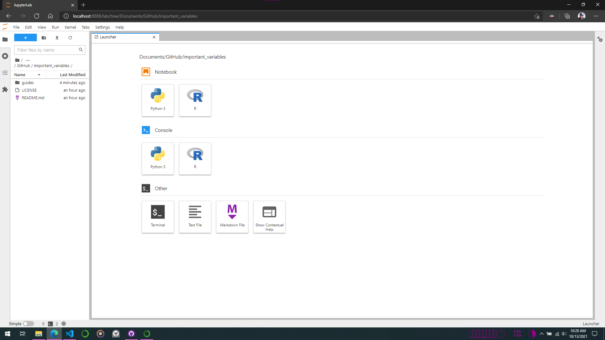
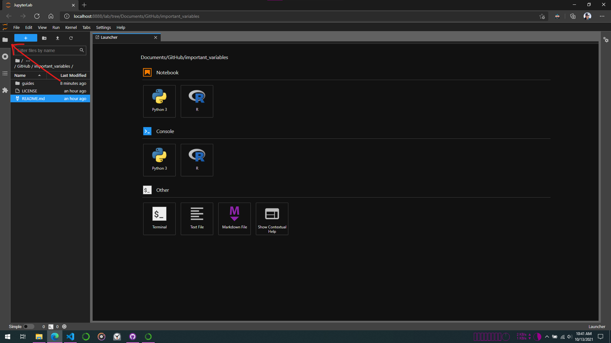

# Intention
This guide is intended for first-time users of JupyterLab as an introduction and a reference. There are many other (probably better) guides on the internet (YouTube is nice) and I encourage you to use those as well.

# Opening JupyterLab
If you installed JupyterLab through Anaconda as I recommend, you must first open the Anaconda interface, then launch JupyterLab from there. JupyterLab will open a tab in your default browser and use that as its interface*. It should look something like this

 

* There is a JupyterLab app now, but I have not used it.

# Themes and Extensions
To change themes go to "Settings -> JupyterLab Theme" then choose your theme. I use the JupyterLab Dark theme so all screenshots from now on will use this theme. Additional themes and other extensions can be installed through the Extension Manager: click on the puzzle icon on the far left panel. We will not need any extensions here.

# File Manager Capabilities
JupyterLab has a built in file manager/explorer. Just click the folder icon on the far left panel.

You can navigate to a folder location, create a new folder, create a new launcher by hitting the + button, then create a new notebook with Python (or R if you have installed R - see my [R installation guide](R_installation_guide.md)).

# Working with a Jupyter Notebook
## Opening a Jupyter Notebook in JupyterLab
To open a notebook just navigate to it in the file manager tab and double click on it.  

The file should open in a new tab in the JupyterLab interface like this

TODO: ADD image

## Navigating a Jupyter Notebook in JupyterLab
You can scroll through this file, but a handy way to jump to different sections is to use JupyterLab's Table of Contents tab shown on the left bar as 3 vertical dots with lines next to them.

The Table of Contents will list all the sections, subsections, and subsubsections of the file. To jump to any of them simply click on them.

## Anatomy of a Jupyter Notebook
Jupyter Notebooks consist of 'cells.' There are three types of cells: Markdown cells, code cells, and output cells.  
### Markdown Cells
* Contain text and MathJax
* Can create Table of Contents entries using Markdown formatting
* Markdown cells will be rendered when they are run (see [Running a Jupyter Notebook in JupyterLab](#running-a-jupyter-notebook-in-jupyterlab))

### Code Cells
* Language can vary - you just have to install the language, then the kernel, Python is the default
* Code will execute when cell is run (see [Running a Jupyter Notebook in JupyterLab](#running-a-jupyter-notebook-in-jupyterlab))

### Output Cells
* Output cells are output from and attached to each code cell if any the code cell has output
* Output cells are not editable
* Output cells are generated when a code cell is run (see [Running a Jupyter Notebook in JupyterLab](#running-a-jupyter-notebook-in-jupyterlab))

You can only edit one cell at a time. The cell you are editing will be highlighted on the left.

## Running a Jupyter Notebook in JupyterLab
### Run Single Cell
To run a cell, hit
'''
Crtl + Enter
'''
or hit the Play button at the top of the tab.  

To run a cell and jump to the next cell, hit
'''
Shift + Enter
'''

### Run Entire Notebook
To run all cells starting from the first, hit the Fast Forward button on the top of the tab.