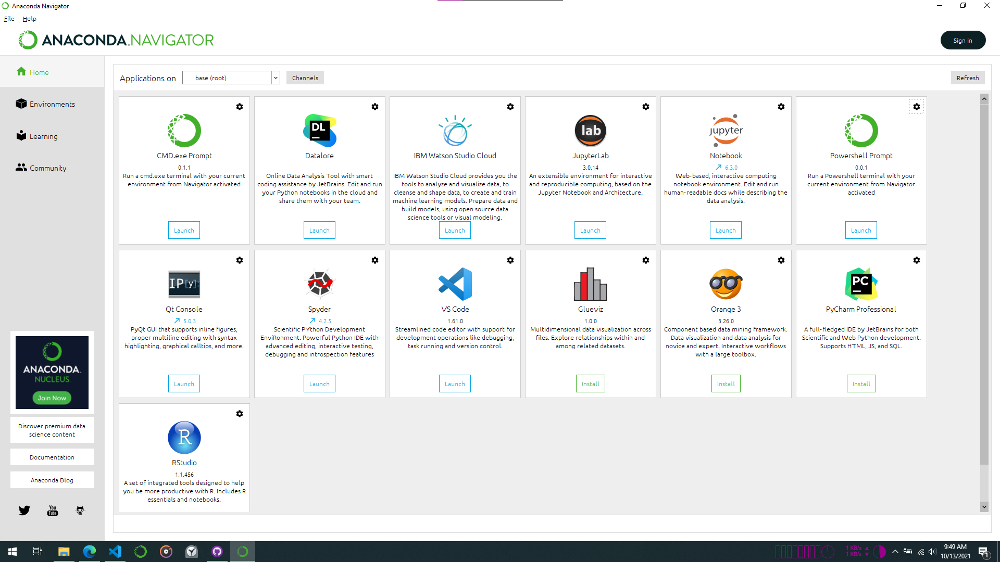

# Recommended Route
To make things as simple and easy as possible, I recommend using [Anaconda](https://www.anaconda.com/), which is a platform to track and manage all your data science tools.  

My favorite way to write code is with JupyterLab, a really nice editor for Jupyter notebooks and other file types.  

Follow the steps below to set everything up.

## Install Anaconda
Just follow the appropriate [Anaconda installation process](https://docs.anaconda.com/anaconda/install/) for your type of machine.

## Open Anaconda
Launch the Anaconda interface just like any other program. It should look like this  

  

This is where you can install and launch several useful data science tools.

## Install JupyterLab
Just click install on the Anaconda interface.  
OR  
1. Open the Anaconda terminal window  
* Launch the program "Anaconda Prompt"  
1. Type or paste: 
'''
conda install -c conda-forge jupyterlab
'''

## Open JuypterLab
Click on "Open" under JupyterLab in the Anaconda interface.

# Alternate Route(s)
Anaconda installs a lot of other tools and resources that we will not use for this project. The benefit of Anaconda is that it does install a large set of compatible tools. You may install Python and JupyterLab without installing Anaconda. This will take up less space on your hard drive and you can get more recent versions of these programs than are included by default in the Anaconda installation.